  

---

## About Me

I'm Farhaan — a CSE student at REVA University, Bangalore, building my way toward an internship-ready engineering skillset.

I work mainly with React on the frontend and Python/FastAPI on the backend, and I'm gradually adding AI-assisted tooling and security-aware development into the mix. My approach is simple: pick a real problem, build something that actually solves it, and learn whatever the project forces me to learn along the way.

I'm not claiming production-scale experience — I'm a student who ships consistently and can explain every line of what I've built.

> _Currently debugging life one stack trace at a time._

---

## Tech Stack

**Frontend**

**Backend & Languages**

**Tools**

---

## Featured Projects

### 🎯 [AptiVision](https://github.com/Far-200/aptivision)
A placement aptitude learning platform that explains reasoning **visually** instead of just showing formulas — built to make topics like Train Problems, Time & Work, Syllogisms, Venn Diagrams, and Percentages actually click.
**Tech:** React, Vite, Tailwind CSS, Framer Motion, React Router

### 🧵 [FlowTrace](https://github.com/Far-200/FlowTrace)
A custom-built C code visualizer that simulates execution — traces variables, control flow, and step-by-step logic so you can *see* a program run instead of just reading it.
**Tech:** React, JavaScript, Monaco Editor, custom parser/interpreter logic

### 📁 [Folder Structure Visualizer](https://github.com/Far-200/folder-structure-visualizer)
Converts typed folder trees into real, downloadable project scaffolds — a small tool that saves genuinely annoying setup time.
**Tech:** React, JavaScript, Tree Parsing, JSZip

### 🧭 [Prompt Model Suggester](https://github.com/Far-200/prompt-model-suggester)
A small tool that looks at a prompt or task and suggests which AI model fits best — built to explore how prompt characteristics map to model strengths.
**Tech:** Python/JavaScript, prompt analysis logic

<b>More projects</b>

 

| Project | Description | Tech |
|---|---|---|
| [VoyagerSim](https://github.com/Far-200/VoygerSim) | Deep-space telemetry simulation inspired by the Voyager missions | JavaScript |
| [DevTool](https://github.com/Far-200/DevTool) | Lightweight JSON formatting & dev utility | React |
| [Password Strength Estimator](https://github.com/Far-200/Password-Strength-Crack-Time-Estimator) | Entropy calculation + brute-force crack time simulation | JavaScript |
| [Regex Playground](https://github.com/Far-200/Regex-Playground) | Interactive playground for building and testing regex | JavaScript |

---

## Learning Timeline

**2024** — Learned JavaScript and React fundamentals; built small frontend UI projects.

**2025** — Moved into full-stack development with Python + FastAPI; built Folder Structure Visualizer and early dev utilities.

**2026 (Now)** — Building AptiVision and FlowTrace; strengthening API design, backend fundamentals, and AI-assisted tooling; preparing for software internships.

---

## Current Focus

<table>
<tr>
<td width="33%" valign="top">

**Building**
- Full-stack apps
- AI-assisted tools
- Developer utilities

</td>
<td width="33%" valign="top">

**Grinding**
- DSA & problem patterns
- Clean coding habits
- Algorithmic thinking

</td>
<td width="33%" valign="top">

**Preparing**
- Internship applications
- Technical interviews
- A stronger portfolio

</td>
</tr>
</table>

---

## LeetCode

## GitHub Stats

 

---

## Connect

*Still learning, still shipping — one repo at a time.*

