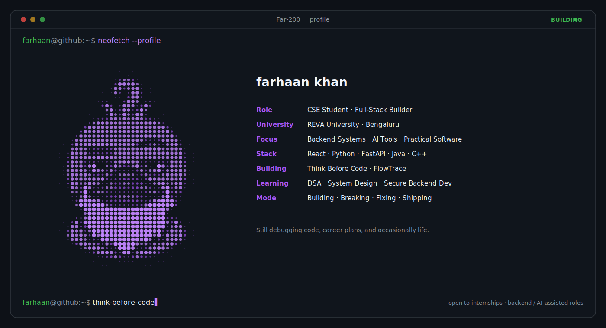

I'm a CSE student at REVA University building full-stack apps, developer tools, and increasingly AI-assisted systems like Think Before Code. Most of what's here started as "let me just try this" and turned into something I can actually defend in an interview (hopefully🫠). I ship things, break them, and write down what I learned.

---

### 🚀 Featured Projects

<table>
<tr>
<td width="50%" valign="top">

**[Think Before Code](https://github.com/Far-200/think-before-code)**

A Socratic DSA tutor (starring Quackrates 🦆) that protects productive struggle instead of handing you the finished answer — one hint at a time.

`Agent Skills` `Prompt Engineering` `DSA`
Status: **Active**

</td>
<td width="50%" valign="top">

**[FlowTrace](https://github.com/Far-200/FlowTrace)**

A step-by-step visualizer for C-like code execution, built on a custom AST interpreter — no compiler, no black box.

`React` `Monaco Editor` `Custom JS Interpreter`
Status: **Maintained**

</td>
</tr>
<tr>
<td width="50%" valign="top">

**[Folder Structure Visualizer](https://github.com/Far-200/folder-structure-visualizer)**

Turns typed/ASCII folder trees into real, downloadable React or Node project scaffolds. [Live demo →](https://foldervisualiser.farhaankhan.dev/)

`React` `JSZip` `Tree Parsing`
Status: **Maintained**

</td>
<td width="50%" valign="top">

**[PromptRouter](https://github.com/Far-200/prompt-model-suggester)**

Chrome extension that recommends the right model for a prompt across Claude, ChatGPT, and Gemini instead of burning a big model on a small task.

`Vanilla JS` `Chrome Extension API`
Status: **Experimental**

</td>
</tr>
</table>

**Also on GitHub:** [VoyagerPulse](https://github.com/Far-200/VoygerSim) (deep-space telemetry simulation) · [Password Strength & Crack-Time Estimator](https://github.com/Far-200/Password-Strength-Crack-Time-Estimator) · [Regex Playground](https://github.com/Far-200/Regex-Playground) · [DevTool](https://github.com/Far-200/DevTool)

---

### 🛠️ Tech Stack

**Languages**
 

**Frontend & Backend**
 

**Tools**
 

---

### 📊 Stats

 

More activity and statistics

 

  

---

### 🌐 Connect

---

_I debug code with hope, snacks, and occasional emotional damage._

