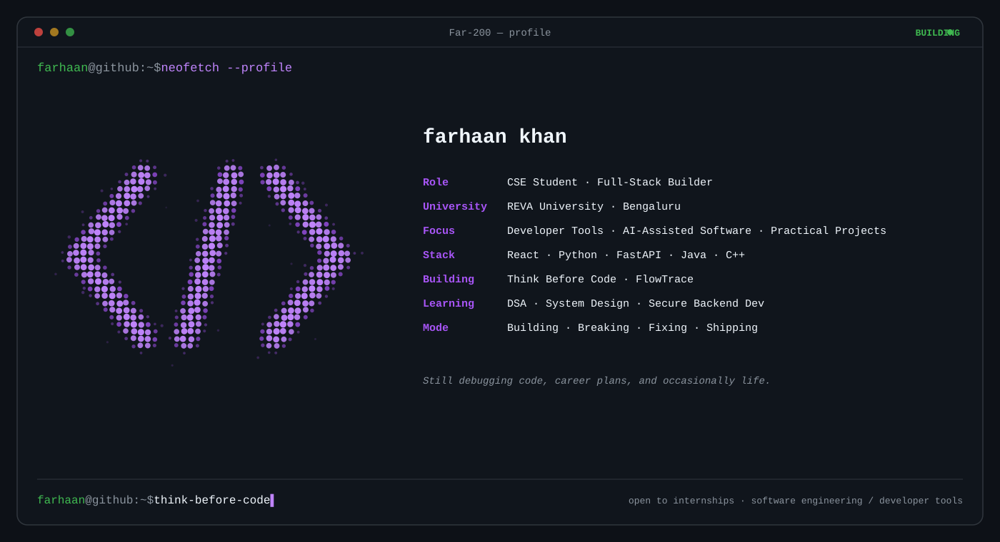

I'm **Farhaan Khan** a final-year CSE student at REVA University building full-stack apps, developer tools, and increasingly AI-assisted systems like Think Before Code. Most of what's here started as "let me just try this" and turned into something I can actually defend in an interview (hopefully🫠). I ship things, break them, and write down what I learned.

---

### 🚀 Featured Projects

#### [Think Before Code](https://github.com/Far-200/think-before-code)

A suite of Socratic Agent Skills (starring Quackrates 🦆) that guide DSA practice one question and one hint at a time — protecting productive struggle instead of handing you the finished answer.

`Agent Skills` `Prompt Engineering` `DSA` 
Status: **Active**

#### [FlowTrace](https://github.com/Far-200/FlowTrace)

A hand-built lexer → recursive-descent parser → AST → tree-walking interpreter that steps through C-like code line by line so you can watch variables change in real time. No compiler. No black box.

`React` `Monaco Editor` `Custom JS Interpreter` 
Status: **Maintained**

#### [Folder Structure Visualizer](https://github.com/Far-200/folder-structure-visualizer)

Parses typed/ASCII folder trees into a structured representation, then generates downloadable React or Node project scaffolds with real files. [Live demo →](https://foldervisualiser.farhaankhan.dev/)

`React` `JSZip` `Tree Parsing` 
Status: **Maintained**

**Also on GitHub:** [PromptRouter](https://github.com/Far-200/prompt-model-suggester) (prompt-aware model recommender) · [VoyagerPulse](https://github.com/Far-200/VoygerSim) (deep-space telemetry simulation) · [Password Strength & Crack-Time Estimator](https://github.com/Far-200/Password-Strength-Crack-Time-Estimator) · [Regex Playground](https://github.com/Far-200/Regex-Playground) · [DevTool](https://github.com/Far-200/DevTool)

---

### 🌐 Connect

---

_I debug code with hope, snacks, and occasional emotional damage._

